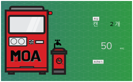

# Envir_project
Ethereum 플랫폼 블록체인을 이용한 캔 재활용 리워드 시스템 

## 프로젝트 설명
블록체인을 활용한 재활용 프로세스로 Smart Contract를 이용해 사용자는 재활용 캔을 재활용 기기에 투입하고 사용자 바코드를 인식하면 리워드를 받는 시스템

## 사용 방법 (예시)
1. 사용자 
     
(a) 사용자 로그인  
(b) 회원 가입  
(c) 로그인 후 사용자 계정 정보 및 잔액 확인  
(d) 계정 사용하기 버튼 클릭 시 제휴사의 QR코드 스캔, 송금  

2. 재활용기계 (내장)  
   
(a) 재활용 기계에 재활용 캔 투입 시, 투입된 개수에 따라 지급되는 코인 출력
(b) 사용자의 QR코드를 인식해 사용자에게 토큰 생성 후 전송

3. 제휴사 예시 (쓰레기봉투 교환)  
   
(a) 교환하고 싶은 쓰레기봉투를 선택, 선택한 수량에 따른 사용량 출력  
(b) 사용처에서 QR코드를 만들어 사용자가 인식하면 사용처에 토큰 전송